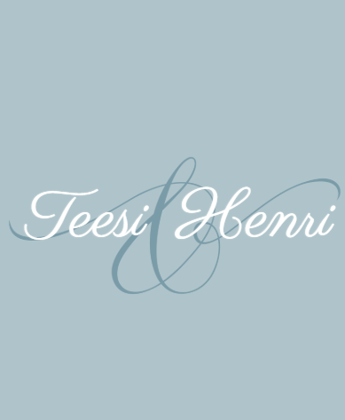

<!DOCTYPE html>
<html lang="et">
<head>
  <meta charset="UTF-8" />
  <meta name="viewport" content="width=device-width, initial-scale=1.0" />
  <meta name="description" content="Teesi ja Henri pulmaleht – info pulmapäeva kohta ja ühine Google Photos pulmaalbum." />
  <title>Teesi & Henri pulm</title>

  <!-- Parisienne font -->
  <link rel="preconnect" href="https://fonts.googleapis.com">
  <link rel="preconnect" href="https://fonts.gstatic.com" crossorigin>
  <link href="https://fonts.googleapis.com/css2?family=Parisienne&family=Cormorant+Garamond:wght@400;500;600&family=Montserrat:wght@300;400;500;600&display=swap" rel="stylesheet">

  <link rel="stylesheet" href="style.css" />
</head>
<body>
  <header class="topbar">
    <a href="#avaleht" class="nav-logo">T & H</a>
    <nav>
      <a href="#info">Info</a>
      <a href="#paevakava">Päevakava</a>
      <a href="#pildid">Pildid</a>
      <a href="#kingitus">Kingitus</a>
    </nav>
  </header>

  <main>
    <section class="hero" id="avaleht">
      

        

        
Olete kutsutud meie pulmapäevale

        <h1>Teesi & Henri</h1>
        
22. august 2026 · Viinistu Kunstimuuseum

        

          Meil on väga hea meel tähistada seda päeva koos teiega.
          Siit lehelt leiate kogu olulise info pulmapäeva kohta ning lingi meie ühisesse pulmaalbumisse.
        

        

          <a class="button primary" href="#pildid">Lisa pildid albumisse</a>
          <a class="button secondary" href="#info">Vaata infot</a>
        

      

    </section>

    <section class="section intro-section">
      
Kallid külalised

      

        Aitäh, et olete osa meie loost. Palume teil pulmapäeval jäädvustada hetki,
        mida meie ise võib-olla ei märkagi — naeratusi, tantsu, väikeseid vahehetki ja kõike seda,
        mis teeb selle päeva päriselt meie päevaks.
      

    </section>

    <section class="section cards-section" id="info">
      

        
Pulmapäeva info

        <h2>Oluline teada</h2>
      

      

        <article class="info-card">
          01
          <h3>Asukoht</h3>
          
Viinistu Kunstimuuseum Viinistu, Harjumaa

        </article>

        <article class="info-card">
          02
          <h3>Algus</h3>
          
Kogunemine kell 15:30 Tseremoonia kell 16:00

        </article>

        <article class="info-card">
          03
          <h3>Dresscode</h3>
          
Pidulik, suvine ja elegantne. Toonid võivad olla pehmed, mereäärsed ja romantilised.

        </article>

        <article class="info-card">
          04
          <h3>Majutus</h3>
          
Majutus on organiseeritud pruutpaari poolt. Täpsem info edastatakse külalistele eraldi.

        </article>
      

    </section>

    <section class="section timeline-section" id="paevakava">
      

        
Päevakava

        <h2>Meie pulmapäev</h2>
      

      

        
15:30
Kogunemine

        
16:00
Tseremoonia

        
16:45
Õnnesoovid ja pildistamine

        
18:00
Õhtusöök

        
19:30
Bänd, tants ja trall

        
22:30
Pulmatort

        
09:00–11:00
Hommikusöök

        
12:00
Kojusõit

      

    </section>

    <section class="section photos-section" id="pildid">
      

        

          
Pulmaalbum

          <h2>Jaga meiega oma pilte</h2>
          

            Skanni QR-kood või vajuta nupule ja lisa oma fotod ning videod meie ühisesse
            Google Photos pulmaalbumisse. Kõige armsamad hetked on tihti just külaliste telefonides.
          

          <a class="button primary" href="https://photos.app.goo.gl/Ma2B7o86AwjDaia17" target="_blank" rel="noopener">
            Ava Google Photos album
          </a>

          

            Kui lisamine ei avane kohe, kontrolli, et oled Google’i kontoga sisse logitud.
          

        

        

          
          
Skanni ja lisa pildid

        

      

    </section>

    <section class="section gift-section" id="kingitus">
      

        
Kingitus

        <h2>Meie suurim kingitus on teie kohalolu</h2>
      

      

        Kui soovite meid siiski kingitusega rõõmustada, mahub see kõige paremini ümbrikusse.
        Üllatused ja erisoovid palume koordineerida pulmaisaga.
      

    </section>
  </main>

  <footer>
    
Kohtumiseni pulmas

    
Teesi & Henri · 22.08.2026

  </footer>
</body>
</html>
